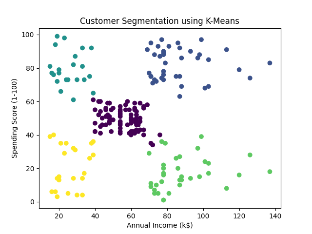

# Customer Segmentation using K-Means Clustering

## Overview
This project applies K-Means clustering to segment customers based on their annual income and spending behavior. The goal is to identify meaningful customer groups that can support data-driven decision-making.

## Problem Statement
Businesses often need to understand customer behavior to improve targeting and personalization. This project aims to group customers into distinct segments based on purchasing patterns.

## Dataset
Mall Customer Segmentation Dataset (Kaggle)  
Features used:
- Annual Income (k$)
- Spending Score (1-100)

## Approach
- Performed data preprocessing and feature selection
- Applied feature scaling using StandardScaler
- Implemented K-Means clustering algorithm
- Visualized clusters to analyze customer segments

## Results
- Successfully identified distinct customer segments
- Observed clear grouping based on income and spending patterns
- Demonstrated how clustering can reveal hidden insights in data

## Visualization

## Tools & Technologies
- Python
- Pandas
- NumPy
- Scikit-learn
- Matplotlib

## Key Learnings
- Practical implementation of unsupervised learning
- Importance of feature scaling in clustering
- Interpreting clustering results for real-world applications

## Future Improvements
- Determine optimal clusters using Elbow Method
- Apply clustering on larger real-world datasets
- Integrate business insights for decision-making