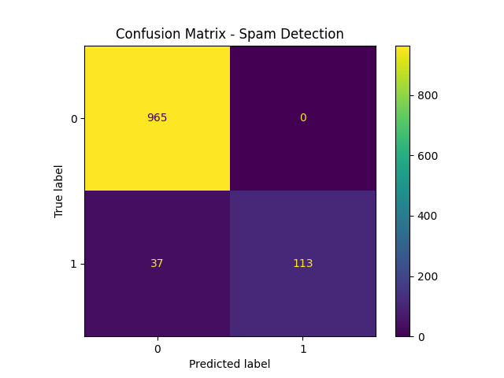

# 📧 Spam Detection using Naive Bayes (NLP)

## 🚀 Overview
This project builds a machine learning model to classify SMS messages as **spam or legitimate (ham)** using Natural Language Processing techniques. It demonstrates an end-to-end data science workflow from preprocessing to model evaluation.

---

## 🎯 Problem Statement
Unwanted spam messages pose a major challenge in communication systems. This project aims to automatically detect spam messages using machine learning to improve user experience and security.

---

## 📊 Dataset
- SMS Spam Collection Dataset
- Contains labeled messages: `ham` (legitimate) and `spam`

---

## ⚙️ Approach

### 1. Data Preprocessing
- Removed unnecessary columns
- Cleaned labels and handled missing values
- Converted categorical labels into binary format

### 2. Feature Engineering
- Applied **TF-IDF Vectorization** to convert text into numerical features
- Removed common stopwords

### 3. Model Training
- Used **Multinomial Naive Bayes**, suitable for text classification

### 4. Evaluation
- Accuracy Score
- Confusion Matrix
- Classification Report (Precision, Recall, F1-score)

---

## 📈 Results
- Achieved high accuracy in spam classification
- Model effectively distinguishes between spam and legitimate messages

---

## 📊 Visualization

### Confusion Matrix

---

## 🛠️ Tech Stack
- Python
- Pandas
- Scikit-learn
- Matplotlib
- NLP (TF-IDF)

---

## 🧠 Key Learnings
- Text preprocessing techniques
- Feature extraction using TF-IDF
- Supervised learning with Naive Bayes
- Model evaluation and interpretation

---

## 🔮 Future Improvements
- Implement advanced models (SVM, Deep Learning)
- Use stemming/lemmatization for better preprocessing
- Deploy as a web application using Flask/Streamlit

---

## 📌 Project Structure
spam-detection-naive-bayes/
│── spam_detection.py
│── spam.csv
│── confusion_matrix.png
│── README.md

---

## 👨‍💻 Author
Aspiring Data Scientist with strong interest in Machine Learning, Cybersecurity, and AI-driven solutions.
